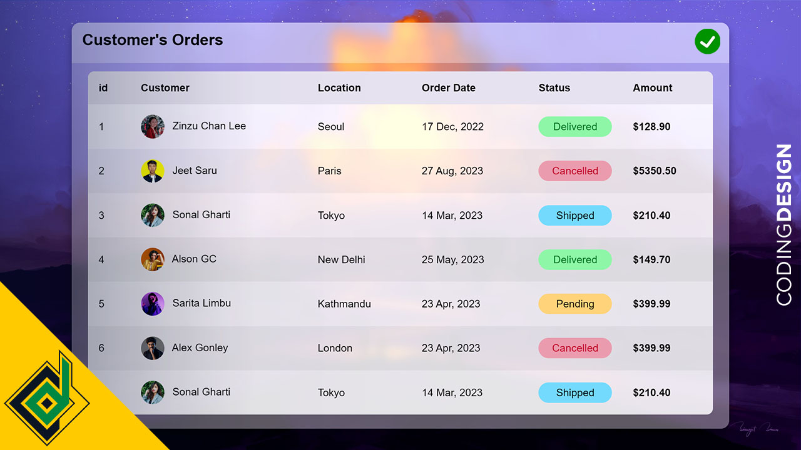

# Responsive HTML Table With Pure CSS - Web Design UI Design

Without using CSS frameworks we'll build **Responsive HTML Table**. So, with pure CSS I'll show you how to create **Glassmorphism Responsive HTML Table**. Let's take UI design to next level.

Code written by:
👨🏻‍⚕️ Coding Design (Jeet Saru)

> You can do whatever you want with the code. However if you love my content, 
> you can **SUBSCRIBED** my YouTube Channel.

🌎link: www.youtube.com/codingdesign 
